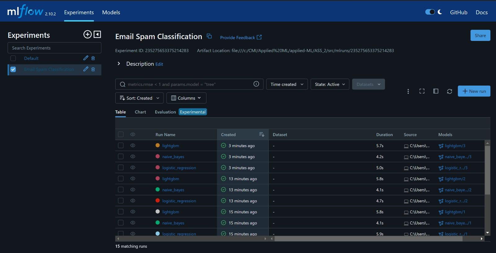
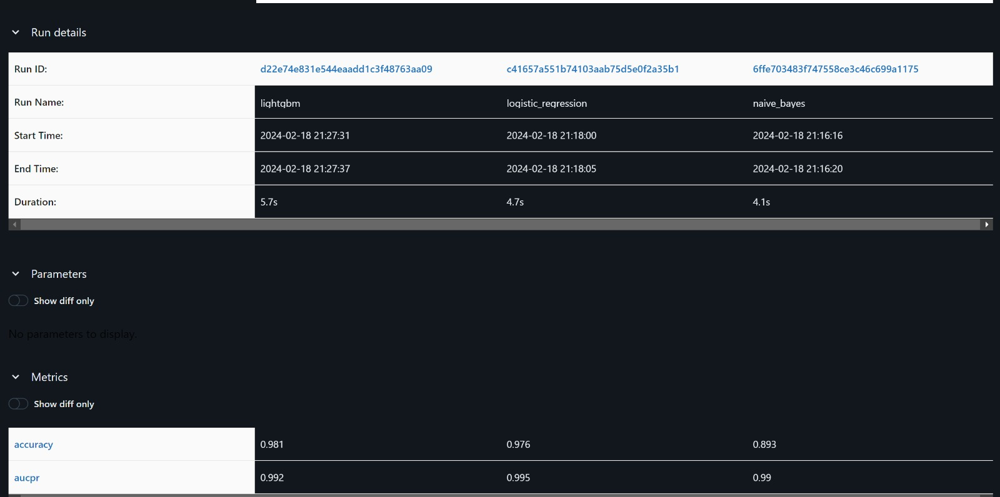
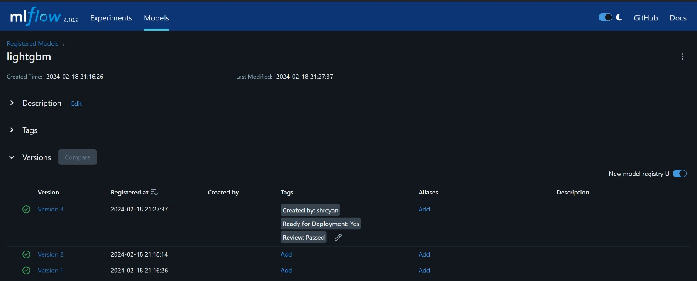
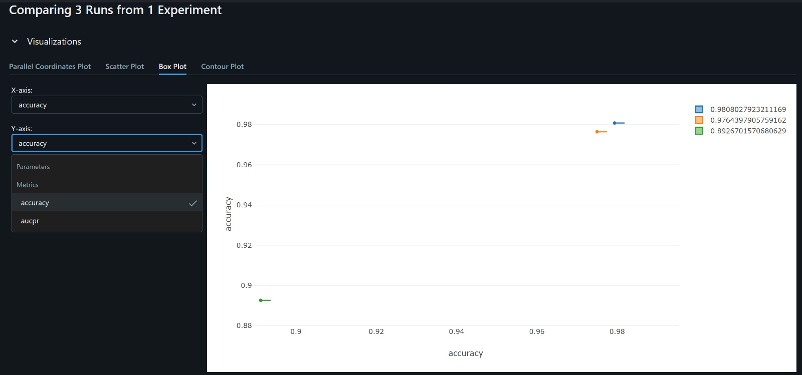

# Email Spam Classification

This project aims to build a prototype for email spam classification using machine learning. It includes data version control with DVC, model version control, and experiment tracking with MLflow.

## Data Version Control with DVC

We have used DVC to track the versions of our dataset. The `prepare.ipynb` notebook includes steps for loading raw data, splitting it into training, validation, and test sets, and then tracking these versions using DVC with Google Drive as storage.

### Initial Data Split

### Updated Data Split with Different Random Seed

## Model Version ContrSol and Experiment Tracking with MLflow

In the `train.ipynb` notebook, we have tracked the experiments and model versions using MLflow. We built, tracked, and registered three benchmark models: LightGBM, Logistic Regression, and Naive Bayes. We also tracked the AUCPR metric for each model.

### MLflow Home

### Model Version Comparison

Here we compare the accuracy and AUCPR metrics of the three models.

### Model Versioning

Below is the version control section showing the different versions of our LightGBM model.

### MLflow Experiment Tracking

The following visualizations show the tracked metrics for our experiments, providing insights into model performance.

